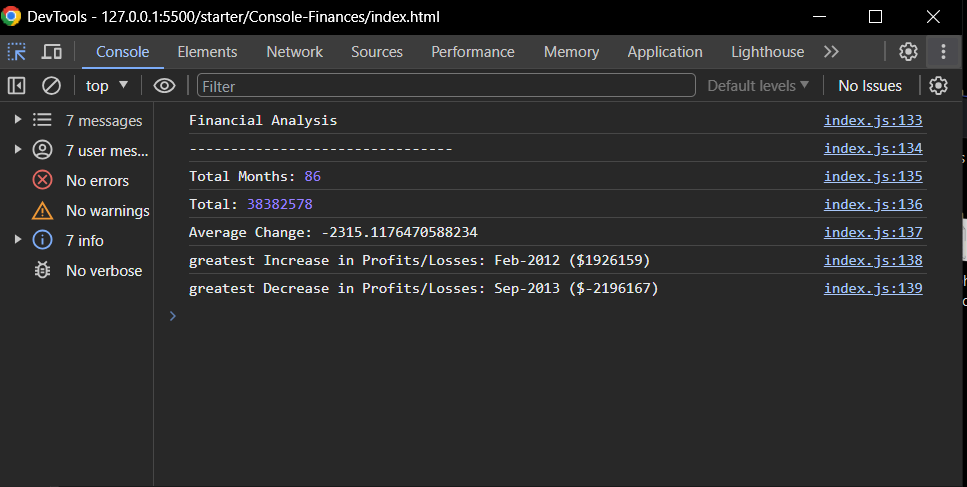

# Console Finance Project

## Overview

This is a console-based finance project designed for analyzing the financial records of a company. The application provides basic functionalities such as tracking income, periods, and displaying an overview of the company's financial situation.

## Features

1. **Period:** Display in months the period of analysis.

2. **Total amount Profit/Losses:** Calculate the Profit/Losses over the entire period.

3. **Average Change:** Display the average changes in Profit/Losses over the entire period.

4. **Greatest Increase/Decrease:** Identify the months with the highest profits and losses throughout the analyzed period.

## Getting Started

- Open your web browser (Google Chrome, Mozilla Firefox, etc.).
- Right-click on the page and select "Inspect" or press `Ctrl + Shift + I` (Windows/Linux) or `Cmd + Opt + I` (Mac) to open the Developer Tools.
- Navigate to the "Console" tab to see the data.

## Preview

You Can see a live demo 